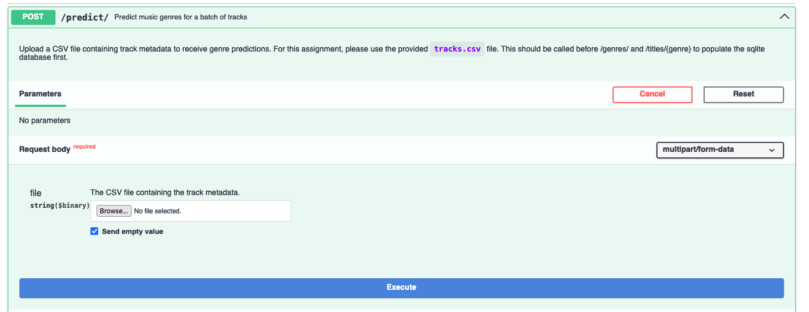

# Music Genre Prediction App

This repository is an end-to-end Machine Learning workflow that I took up as a personal
project. I wanted to hone my skills in all steps of a typical ML project and thus I
decided to task myself with this.

The goal was to use a dataset that has a mix of text data (NLP) and tabular data to
train a model that can predict what genre a song is. 


The final product is a Machine  deployed in a **Docker Container** and served in a
**FastAPI** application that performs inference on test
data, populating and persisting the *Titles* and the *Predicted Genres* of a song in an
embedded database in SQLite that can be queried after.

**NOTE**: This project is quite extensive, but the two main things to look at to observe how the
project was done would be the `genrelabel.ipynb` notebook and this README for the
deployment of the model.
## Project Details:
This end-to-end project covers the following (most of the steps are described and
explained in the Jupter Notebook for this task [here](genrelabel.ipynb)):
1. Exploratory Data Analysis (EDA)
2. Data Cleaning + Data Preprocessing for Model Training
3. Model Training and Evaluation
4. Deployment of Model in Docker Container, API Served Using FastAPI

### Project Structure:
```ascii
MUSIC-GENRE-PREDICTION-APP
├── artifacts
│   ├── model
│   │   ├── losses.png
│   │   └── weights.pt
│   ├── scaler.pkl
│   └── inference_results.db
├── conf
│   ├── inference_config.yaml
│   └── train_config.yaml
├── data
│   ├── data not pushed to GitHub
├── docker
│   └── Dockerfile
├── docs
│   └── openapi.yaml
├── scripts
│   ├── build_docker.sh
│   └── run_app.sh
├── src
│   ├── genrelabeller
│   │   ├── data_preprocessing
│   │   │   ├── data_preparation.py
│   │   │   ├── data_preprocess.py
│   │   │   └── torch_datasets.py
│   │   └── model
│   │       └── model.py
│   ├── test
│   │   ├── data_preprocessing
│   │   │   ├── test_data_preparation.py
│   │   │   └── test_data_preprocess.py
│   │   └── model
│   │       └── test_model.py
│   ├── app.py
│   ├── inference_pipeline.py
│   └── training_pipeline.py
├── requirements.txt
└── genrelabel.ipynb
```

The Structure Tree is quite bloated, so I will give some details on the important parts
here:

* `artifacts` directory: Outputs from the
  `training_pipeline.py` or the `app.py`. The `model` subdirectory contains the trained
  model weights and the train and validation loss plot from the model training.
* `conf` directory: Configurations for the classes written in
  `src`
* `data` directory: Data used in this project, not pushed to GitHub. DM me for the data if needed
* `scripts` directory: Shell scripts to run commands easily from the CLI
* `src` directory: Source code for this project, and pytests for each module.
* `app.py`: Python script that is run when serving the API.
* `inference_pipeline.py`: Pipeline script run to perform inference
* `training_pipeline.py`: Pipeline script run to train a `GenrePredictionModel`
* `requirements.txt`: Dependencies for this project, installed using pip into the docker
  container to ensure the FastAPI app runs smoothly.
* `genrelabel.ipynb`: Jupyter Notebook to accompany this project which shows the EDA and
  skeleton of the project.

# Exploratory Data Analysis

The EDA done is within the [notebook](genrelabel.ipynb). The notebook outlines the
considerations put into building the training and inference pipelines as well.

# Training Your Own Model and Running Inference

As the data cleaning, preprocessing and model training have all been done up in a Python
scripts, if you want to train the model, you may run this in your CLI from project root:
```bash
python src/training_pipeline.py
```

You may also change the hyperparameters used within the `conf/train_config.yaml`, just
make sure to also change parameters like `hidden_size` and `num_layers` as well in the
`conf/inference_config.yaml` since the model has to have the same architecture when
loading the trained weights.

After training the model, you may run the inference pipeline to get `prediction.csv`

```bash
python src/inference_pipeline.py
```


# Running the FastAPI Web Service for Inference

As mentioned above, the `app.py` script handles most of the FastAPI's interface and
operations. 

To ensure that the package can work on other machines (different environments),
containerising the project into a `Docker Container` and running the API from the
isolated environment is a good idea.

## Building Docker Image and Running the Genre Prediction App:
Ensure that the docker daemon is running in the background and from the root directory
of the project, run the following command in your CLI to run the shell
script to build the docker image:

```bash
sh scripts/build_docker.sh
```

Running this script will build the docker image `music-genre-app` in your local Images
directory.

Once it is finished building the image, run the following command in your CLI:

```bash
docker run -d -p 80:80 --name music-genre -v "$(pwd)/artifacts:/app/artifacts" music-genre-app 
```

This command does the following:
1. Runs the docker container
2. Exposes `port 80`
3. Mounts the local `artifacts` directory to the container (for local access to the
   `inference_results.db` SQLite database)
4. Names the instance of the running container as `music-genre`

To check that the container is running, run the following command:
```bash
docker ps
```

Once it's running, you can also check the logs to find the URL the API is being served:

```bash
docker logs music-genre
```

Expected output if container is running:


To see the `Music Genre Prediction API`, go to the following URL in your browser:
[http://0.0.0.0:80/docs]

You should see the following page:


## Calling Model Inference Using the API and `test.csv`

Curl equivalent:
```bash
curl -X POST "http://0.0.0.0:80/predict/" -H "Content-Type: multipart/form-data" -F "file=@data/test.csv" 
```

To use the API to call inference on the `GenrePredictionModel`, click on the drop down
menu for the `/predict/` end point. There will be some details on the endpoint and what
is function is.

### Performing Inference with the Model:
### 1. Click on `Try it out` on the right side


### 2. Click on `Browse...` and upload the `test.csv` file from your local machine onto the web service


### 3. Click the blue `Execute` button, which will essentially send a `curl POST` request.
   The data from `test.csv` will be preprocessed and model inference will be carried
   out. The results of the inference can be found under the `Response body` under
   `Details`
   

When inference is performed, a **SQLite Database** is populated and saved in the docker
container's `artifacts` folder. Since we mounted our local `artifacts` folder when
calling the `docker run` command, the database is saved in our local folder at
`artifacts/inference_results.db`.

## Getting the List of Genres in the SQLite Database and the Song Titles Assigned to A Genre:
Note: The following 2 steps should be run after the SQLite database is populated as they
read the database for outputs.

To get the list of unique genres in the SQLite database, scroll down to the `/genres/`
endpoint and click on the drop down.

Curl equivalent:
```bash
curl -X GET "http://0.0.0.0:80/genres/" 
```

### Getting the Genres
### 1. Click `Try it out` on the right side
### 2. Click the blue `Execute` Button. Similar to before, the list of unique genres is
   under the `Response body` under `Details`
   

To get the list of songs classified in a specific genre in the SQLite database, scroll
down to the `/titles/{genre}` endpoint and click on the drop down.

Curl equivalent:
```bash
curl -X GET "http://0.0.0.0:80/titles/Pop" 
```

### Getting the Songs for a Genre
### 1. Click `Try it out` on the right side
### 2. Type out a unique genre in the `genre` field
Let's try looking for songs assigned to the "Pop" genre

### 3. Click the blue `Execute` Button. Similar to before, the list of songs in a unique genre is
   under the `Response body` under `Details`
   

## Shutting Down the Docker Container
After you're done using the API, you can shut the container instance down using the
following command:
```bash
docker stop music-genre
```

You can check with a `docker ps` to see if the container is still running.

## Running PyTests:
To run the pytests written in `src/test`, run the following command in CLI:
```bash
pytest src
```

### PS:
Apologies, I didn't have time to write docstrings for every method in my pipeline and
app python scripts, hopefully my code is easy enough to understand. 

This end-to-end project was a fun challenge and I appreciated it, thanks for viewing my work!